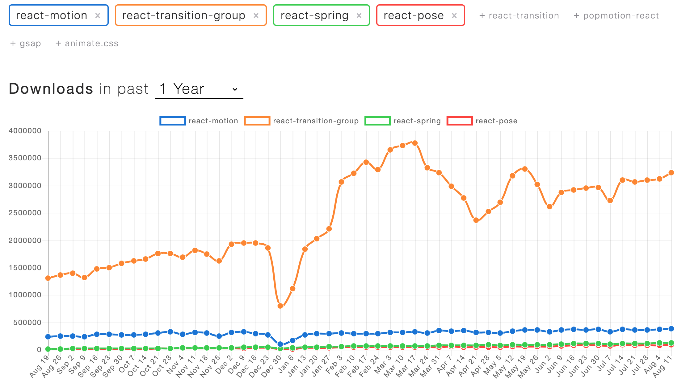
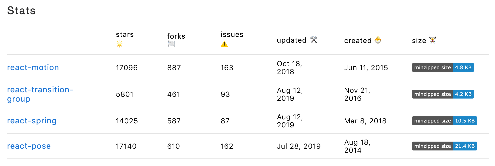

# react-animation-training

Training for animations on React

## npm trends

[react-motion vs react-transition-group vs react-spring vs react-pose](https://www.npmtrends.com/react-motion-vs-react-transition-group-vs-react-spring-vs-react-pose) on 2019/08/12 (JST)





`react-motion` seems to be not maintained.

## How to run

```sh
$ yarn # npm install
$ yarn start # npm start
```

## Requirements

- Node.js v8.xx
  - Probably the newer version is also fine.
- Recommend to use version manager [asdf](https://github.com/asdf-vm/asdf).

## Npm scripts

```sh
$ yarn                  # install dependencies
$ yarn start            # build and launch a development server
$ yarn build            # build and generate the production codes
$ yarn format           # format and save any codes with prettier
$ yarn lint             # lint source codes after format automatically
$ yarn style            # lint css and alt-css after format automatically
$ yarn test             # run the test codes using Jest framework
$ yarn test:watch       # run tests and watch for changes
$ yarn deploy           # deploy the production codes but currently not used
$ yarn license          # display summary of OSS licenses which are bundled in production codes
$ yarn storybook        # run the UI component test codes and launch a development server
$ yarn storybook:build  # generate the UI component docs using StoryBook
```

## License

[MIT License](https://github.com/diescake/igata/blob/master/LICENSE)

## Author

Daisuke Kondo (a.k.a [diescake](https://twitter.com/diescake))
